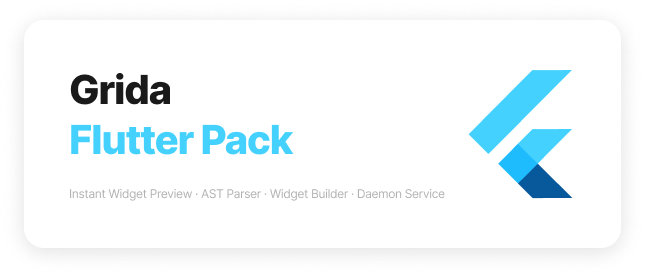

# Grida Flutter Pack

## Flutter Preview

Flutter Preview is a Instant flutter widget previewer for VSCode (and other IDEs) that allows you to preview flutter widgets by interest, without running the whole app.

- [source](./flutter-preview/)

## Flutter AST

Flutter AST parser.

Both available as a dart package and a nodejs package (ported).

- [pub package](https://pub.dev/packages/flutter_ast)
- [npm package](https://www.npmjs.com/flutter-ast)
- [source](./flutter-ast/)

## Flutter Daemon

Flutter Daemon NodeJS Client is a wrapper for flutter daemon, which you can run flutter commands on nodejs using socket connections.

- [source](./flutter-daemon/)

## Flutter Widget Builder

Flutter Widget Builder for NodeJS/Typescript which allows you to build flutter widget tree on nodejs/browser platforms using the same flutter syntax. used by [code](https://github.com/gridaco/code)

- [source](./flutter-builder/)
