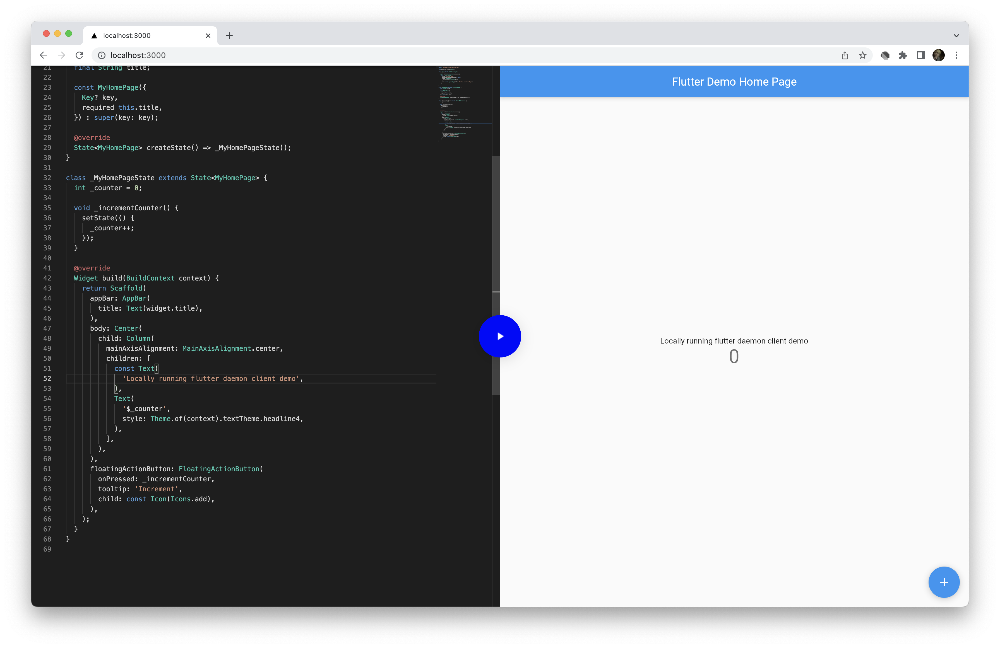

## `@flutter-daemon/client` example (with bundled server)



First, run the development server:

```bash
# run web only
yarn dev

# run with daemon server
yarn serve
```

Open [http://localhost:3000](http://localhost:3000) with your browser to see the result.

You can start editing the page by modifying `pages/index.js`. The page auto-updates as you edit the file.

> You need flutter installed locally.
